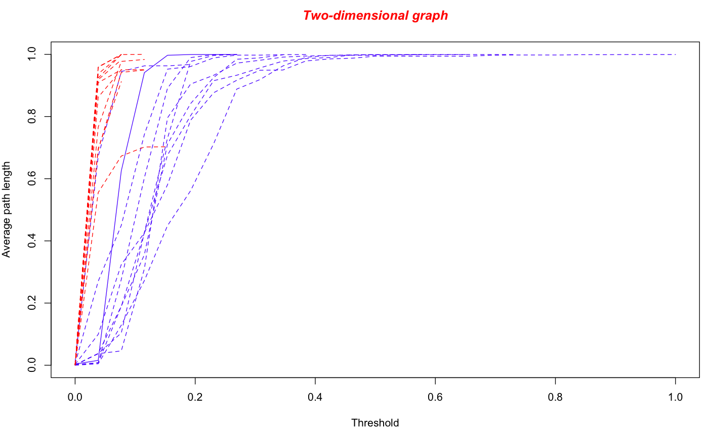
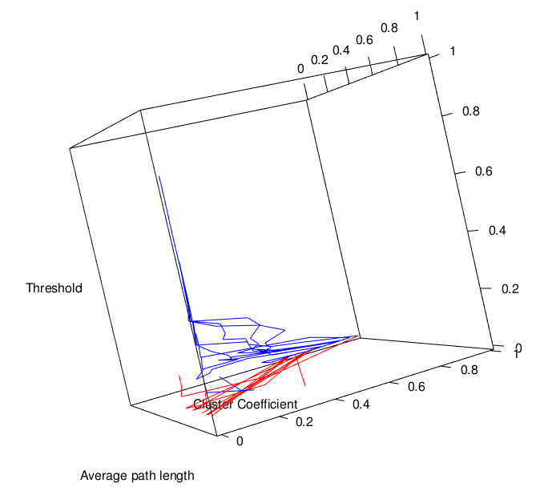

## Introduction
<div style="text-align: justify">
The BASiNET package aims to classify messenger RNA and long non-coding RNA, optionally also a third class such as small non-coding RNA may be included. The classification is made from measurements drawn from complex networks, for each RNA sequence a complex network is created. The networks are formed of vertices and edges, the vertices will be formed by words that can have their size defined by the parameter 'word'. It is adopted a methodology of Thresholds in the networks so that each extraction of measures is made a cut in the network for a new extraction of measures. Finally, all measurements taken from the networks are used for classification using the algorithms J48 and Random Forest. There are two data present in the BASiNET package, "sequences" and "sequences2" with 11 and 10 sequences respectively. These sequences were taken from the data set used in the article (LI, Aimin; ZHANG, Junying; ZHOU, Zhongyin, Plek: a tool for predicting long non-coding messages and based on an improved k-mer scheme BMC bioinformatics, BioMed Central, 2014). These sequences are used to run examples.
</div>
## classification()
<div style="text-align: justify">
The function classification () applies an RNA classification methodology, at the end of the execution of the function is exposed the result for two classification algorithms: J48 and Random Forest.
</div>
Parameters:
<div style="text-align: justify">
word - Define the number of nitrogenous bases that formed a word. By default the word parameter is set to 3.

step - Defines the distance that will be traversed in the sequence for the formation of a new connection. By default the step parameter is set to 1

mRNA - Directory of an FASTA file containing mRNA sequences.

lncRNA - Directory of an FASTA file containing lncRNA sequences.

sncRNA - Directory of an FASTA file containing lncRNA sequences, this parameter is optional.

graphic - If TRUE is used to generate two-dimensional graphs between Thresholds x Measure. By default it is considered FALSE.

graphic3D - If TRUE is the generation of three-dimensional graphs between the Thresholds x Measure1 x Measure2. By default it is considered FALSE.
</div>
<div style="text-align: justify">
Within the BASiNET package there are two sample files, one for mRNA sequence and one for lncRNA sequences. For the example below you will use these two files.
</div>
Defining parameters:

word<-3

step<-1

mRNA <- system.file("extdata", "sequences2.fasta", package = "BASiNET")

lncRNA <- system.file("extdata", "sequences.fasta", package = "BASiNET")

library(BASiNET) #loading package
<div style="text-align: justify">
classification(word, step, mRNA, lncRNA, graphic=TRUE, graphic3D=TRUE) #executing the function with the parameters defined above and with the visualization of the 2D and 3D graphs of the measurements

After the completion of the function the results for J48 and Random Forest will be shown. For example data the results are J48 = 95.2381% hit, Random Forest = 4.76% error.

It will also generate 10 two-dimensional graphs, one for each measurement. And 45 3D graphs that are composed by Threshold x Measure1 x Measure2, so the 45 graphs correspond to all possible combinations between the two measurements. The blue lines represent the mRNA sequences, red lines are the lncRNA and when you have a third class will be represented by green lines.
</div>
Examples of generated graphs:

Bidimensional graph for the measurement Average Minimum Path
```{r, out.width = "400px"}

```

Three-dimensional chart for the measurement Average Minimum Path x Cluster coefficient
```{r, out.width = "400px"}

```